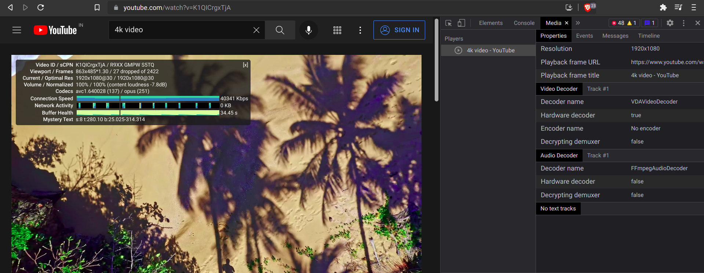
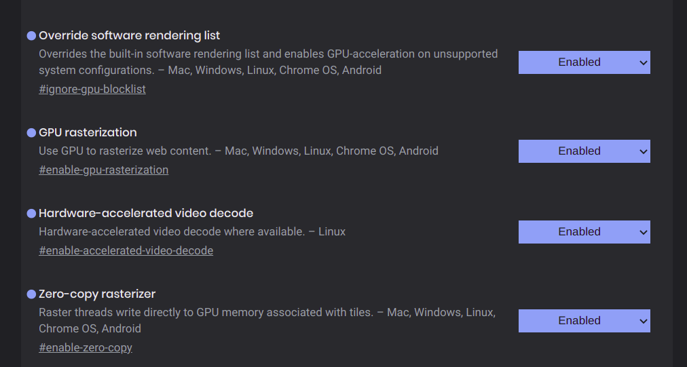

# Enable vaapi settings for brave browser

Inspect element -> Media


`brave://gpu`


`--use-gl=desktop --enable-features=VaapiVideoDecoder`

Use these command line arguments when launching brave browser. 

Better, replace the `.desktop` entry for brave browser in `/usr/share/applications/` with this in the appropriate places (Make sure to remove the trailing `%U` option in the `Exec` line which is present by default in the `.desktop` file).

```plaintext
Exec=/usr/bin/brave-browser-stable --use-gl=desktop --enable-features=VaapiVideoDecoder
```

Enable these in `brave://flags`


Install this extension
[enhanced-h264ify](https://github.com/alextrv/enhanced-h264ify)


> This is weird, idk why - (i think this is not required)
> 
> On ubuntu - 

> `wget https://launchpad.net/\~saiarcot895/+archive/ubuntu/chromium-dev/+files/vdpau-va-driver_0.7.4-7ubuntu1\~ppa2\~20.04.1_amd64.deb -O vdpau.deb`

> then 

> `sudo dpkg -i vdpau.deb`


--- 

## Extras - 

Install these extensions - 
- [fastforward](https://fastforward.team/)
- [SponsorBlock](https://sponsor.ajay.app/)
- [uBlock](https://github.com/gorhill/uBlock)

---

Install these also on other browsers - 

- [privacy badger](https://privacybadger.org/)
- [ClearURLs](https://clearurls.xyz/)
- [https-everywhere](https://www.eff.org/https-everywhere)
