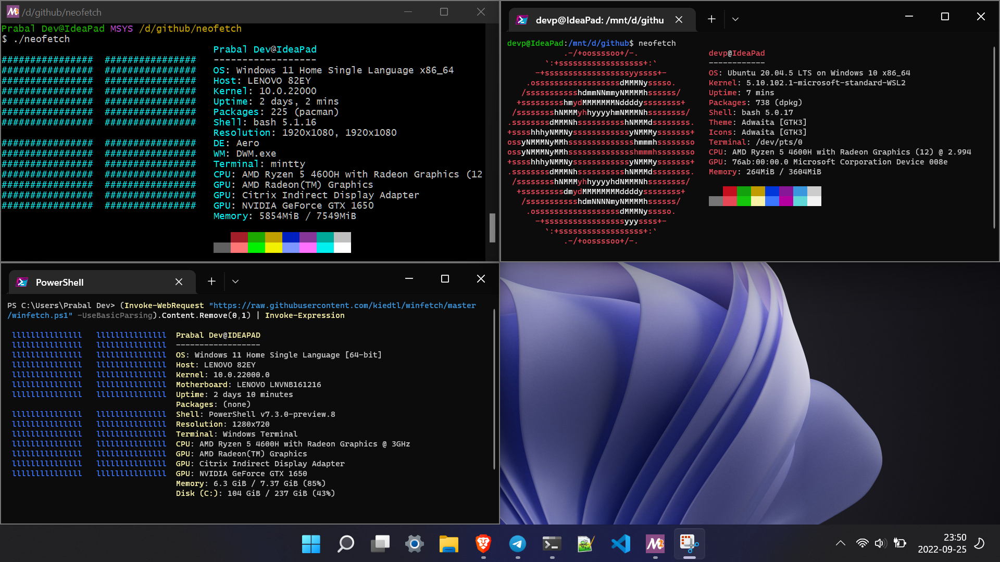

# Windows Notes


## Powershell (https://aka.ms/powershell)

- [install preview version from releases, example PowerShell-7.2.0-preview.10-win-x64.msi](https://github.com/PowerShell/PowerShell/releases/tag/v7.2.0-preview.10)
- [docs](https://docs.microsoft.com/en-us/powershell/scripting/install/installing-powershell-on-windows?view=powershell-7.1)


## Windows terminal

- can be installed from Microsoft store


## wsl

```powershell
wsl --install
wsl --install -d <DistroName>
```

**Starting docker daemon**

```bash
sudo service docker start
```


## winget

- [docs and usage](https://docs.microsoft.com/en-us/windows/package-manager/winget/)
- Install AppInstaller Preview (not directly present on Microsoft store) version 1.1.12701 or higher from [release page on github](https://github.com/microsoft/winget-cli/releases). Example, install this `Microsoft.DesktopAppInstaller_8wekyb3d8bbwe.msixbundle` from their release.
- [all packages availabe via winget | github repo](https://github.com/microsoft/winget-pkgs)


## gcc on windows

- [Follow these steps to install msys2, mingw, gcc, vscode C++ extensions](https://code.visualstudio.com/docs/cpp/config-mingw)
- [steps to install mingw, gcc using msys2](https://www.msys2.org/)
- Add `mingw` to `PATH` (search from start menu **Edit system enviroment variables** or **Edit system enviroment variables for your account**). The path to bin would be `C:\msys64\mingw64\bin` if installed using msys2 as linked above.


## Kill all instance of a program from `cmd`

```cmd
TASKKILL /F /IM msedge.exe
TASKKILL /F /IM Code.exe
```

The first one kills all MS Edge browser instances, the second one does that for Visual Studio Code. The way to identify the name is to find it via Task Manager.


## [`winfetch`](https://github.com/kiedtl/winfetch) (a utility similar to `neofetch` on linux)

```cmd
(Invoke-WebRequest "https://raw.githubusercontent.com/kiedtl/winfetch/master/winfetch.ps1" -UseBasicParsing).Content.Remove(0,1) | Invoke-Expression
```



## Internet not working in `wsl`

Possible errors like failure in name resolution for github (`git push` not working), etc. A workaround for [this known issue](https://github.com/microsoft/WSL/issues/8390) is to edit `/etc/resolv.conf` and set nameserver to `8.8.8.8`.
